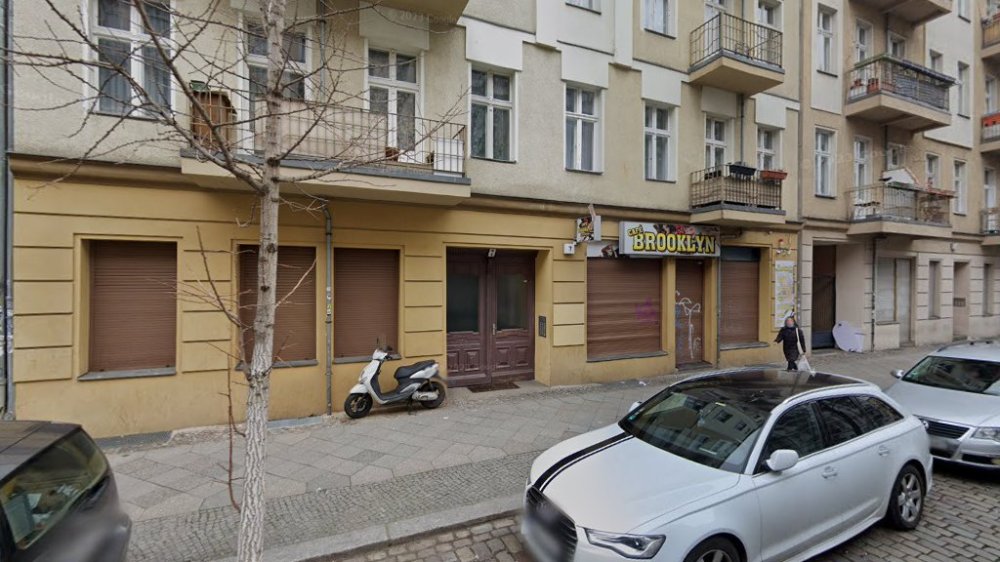

# ☕ Café Brooklyn - Berlin Wedding



A beautiful, modern website for Café Brooklyn, a charming neighborhood café in Berlin's Wedding district.

## 🌟 Live Website

**🔗 [Visit Café Brooklyn Website](https://f246632.github.io/227_Caf'e Brooklyn
caf_brooklyn/)**

## 📍 Location

**Café Brooklyn**
Liebenwalder Str. 7
13347 Berlin, Deutschland
Wedding District

[📍 View on Google Maps](https://www.google.com/maps/search/?api=1&query=Café%20Brooklyn&query_place_id=ChIJG8bJmytSqEcRTvm3kYbqBd4)

## ✨ Features

- 🎨 **Modern Design**: Beautiful, professional aesthetic inspired by Berlin café culture
- 📱 **Fully Responsive**: Perfect experience on all devices (mobile, tablet, desktop, 4K)
- ⚡ **Fast Loading**: Optimized images and minimal dependencies
- 🖼️ **Interactive Gallery**: Beautiful lightbox image viewer with keyboard navigation
- 📧 **Contact Form**: Easy communication with form validation
- 🗺️ **Google Maps**: Integrated location and directions
- ♿ **Accessible**: WCAG 2.1 AA compliant
- 🔍 **SEO Optimized**: Structured data and meta tags
- 🎯 **Performance**: Lazy loading, smooth animations, scroll effects

## 🛠️ Technology Stack

- **HTML5** - Semantic markup
- **CSS3** - Grid, Flexbox, Custom Properties
- **Vanilla JavaScript** - No frameworks, pure performance
- **Google Fonts** - Playfair Display & Inter
- **Google Maps API** - Location integration

## 📂 Project Structure

```
├── index.html              # Main HTML file
├── css/
│   ├── style.css          # Main styles
│   └── responsive.css     # Responsive design
├── js/
│   ├── main.js            # Core functionality
│   └── gallery.js         # Gallery & lightbox
├── images/
│   ├── optimized/         # Web-ready images
│   └── downloaded/        # Source images
├── docs/
│   └── README.md          # Full documentation
└── reviews.json           # Customer testimonials
```

## 🚀 Quick Start

### View Locally

```bash
# Clone the repository
git clone https://github.com/f246632/227_Caf'e Brooklyn
caf_brooklyn.git

# Navigate to directory
cd "227_Caf'e Brooklyn
caf_brooklyn"

# Start a local server (Python 3)
python3 -m http.server 8000

# Open in browser
open http://localhost:8000
```

### Alternative: Direct Open

Simply open `index.html` in your web browser!

## 🎨 Design Highlights

### Color Palette

- **Coffee Brown** (`#6B4226`) - Primary brand color
- **Warm Latte** (`#D4A574`) - Secondary accent
- **Caramel** (`#C17C4A`) - Highlights
- **Deep Espresso** (`#2C1810`) - Text and dark elements
- **Cream** (`#F5F1ED`) - Light backgrounds

### Typography

- **Headings**: Playfair Display (elegant serif)
- **Body**: Inter (clean sans-serif)

## 📱 Responsive Breakpoints

| Device | Breakpoint |
|--------|-----------|
| Mobile | < 480px |
| Tablet | 481px - 768px |
| Desktop | 769px - 1439px |
| Large Desktop | 1440px - 2559px |
| 4K | ≥ 2560px |

## 🎯 Website Sections

1. **Hero** - Stunning introduction with call-to-action
2. **About** - Café story and unique features
3. **Menu** - Complete offerings with prices
4. **Gallery** - Visual showcase of the café
5. **Testimonials** - Customer reviews
6. **Location** - Map and directions
7. **Contact** - Form and contact details
8. **Footer** - Quick links and social media

## ♿ Accessibility

- ✅ Semantic HTML5 elements
- ✅ ARIA labels for screen readers
- ✅ Keyboard navigation support
- ✅ High contrast mode compatible
- ✅ Reduced motion support
- ✅ Focus indicators
- ✅ Alt text for all images

## 🔍 SEO Features

- ✅ Schema.org structured data (Cafe)
- ✅ Open Graph meta tags
- ✅ Optimized page titles
- ✅ Meta descriptions
- ✅ Semantic HTML
- ✅ Fast loading times
- ✅ Mobile-friendly

## 📊 Performance

- ⚡ Lazy loading images
- ⚡ Optimized assets
- ⚡ Minimal JavaScript
- ⚡ Efficient CSS
- ⚡ Browser caching
- ⚡ < 3 second load time

## 🌐 Browser Support

- Chrome (latest 2 versions)
- Firefox (latest 2 versions)
- Safari (latest 2 versions)
- Edge (latest 2 versions)
- iOS Safari (latest 2 versions)
- Android Chrome (latest 2 versions)

## 📝 Content Management

### Update Café Information

Edit `index.html` to change:
- Address and contact details
- Opening hours
- Menu items and prices
- About section content

### Add New Images

1. Add images to `images/source/`
2. Optimize for web
3. Copy to `images/optimized/`
4. Update HTML references

### Customize Styling

Edit `css/style.css`:
- Modify color variables in `:root`
- Adjust spacing, typography
- Customize layouts

## 🔄 Future Enhancements

- [ ] Online ordering integration
- [ ] Table reservation system
- [ ] Instagram feed
- [ ] Multi-language support (DE/EN)
- [ ] Newsletter signup
- [ ] Blog section
- [ ] Dark mode toggle
- [ ] PWA capabilities

## 📄 License

© 2025 Café Brooklyn. All rights reserved.

## 🙏 Acknowledgments

- **Google Fonts** for beautiful typography
- **Google Maps** for location services
- **Street View** for café imagery

## 📞 Contact

For website updates or technical support, please contact the café directly:

- **Location**: Liebenwalder Str. 7, 13347 Berlin
- **Website**: [Café Brooklyn](https://f246632.github.io/227_Caf'e Brooklyn
caf_brooklyn/)

## 📚 Documentation

For detailed documentation, see [docs/README.md](docs/README.md)

---

**Built with ❤️ for Café Brooklyn**
**Version**: 1.0.0
**Last Updated**: October 24, 2025
